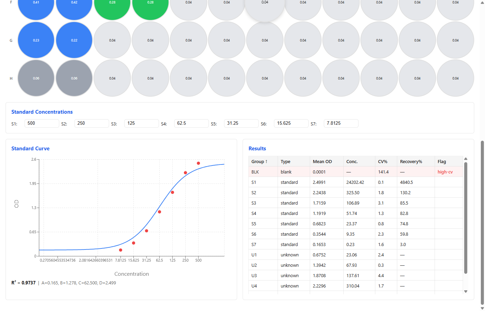

# ElisaLab

**Open-source ELISA plate data analysis — paste, fit, report.**

Replace Excel and MyAssays with a clean web tool: paste your plate reader data, fit a 4-Parameter Logistic curve, and get interpolated concentrations in seconds.



## Features

- **Plate Data Import** — paste from Excel or upload CSV; auto-parses 8×12 OD grids
- **Visual Plate Layout Editor** — click to assign wells as Standard, Unknown, Blank, or Empty with color-coded display
- **4PL Curve Fitting** — Levenberg–Marquardt least-squares optimization with R² goodness of fit
- **Concentration Interpolation** — inverse 4PL solves unknown concentrations from the fitted standard curve
- **Statistics** — mean, SD, CV% for replicate groups; flags high-CV (>15%) and out-of-range samples
- **Interactive Standard Curve Chart** — log-concentration vs OD scatter with 4PL overlay (Recharts)
- **Sortable Results Table** — Well, Sample, OD, Concentration, CV%, Flags with inline editing
- **Export** — download results as CSV and standard curve chart as PNG

## Quick Start

```bash
# Clone and install
git clone https://github.com/your-org/elisalab.git
cd elisalab
pnpm install

# Start the dev server
pnpm dev
# → http://localhost:1441
```

## Key Equations

**4-Parameter Logistic (4PL) model:**

```
y = D + (A − D) / (1 + (x / C)^B)
```

| Parameter | Meaning            |
|-----------|--------------------|
| A         | Minimum asymptote  |
| B         | Hill slope          |
| C         | IC50 / EC50        |
| D         | Maximum asymptote  |

**Inverse 4PL** (solve for concentration):

```
x = C × ((A − D) / (y − D) − 1)^(1/B)
```

**Goodness of fit:**

```
R² = 1 − (SS_res / SS_tot)
```

## Tech Stack

| Layer   | Technology                     |
|---------|--------------------------------|
| Engine  | TypeScript, Levenberg–Marquardt |
| Web     | React 19, Vite, Recharts       |
| Testing | Vitest, Testing Library        |
| Monorepo| pnpm workspaces                |

## Project Structure

```
elisalab/
├── packages/
│   ├── engine/          # Pure-TS curve fitting & analysis
│   │   └── src/
│   │       ├── parser.ts         # Plate data parsing (paste/CSV)
│   │       ├── layout.ts         # Well type assignments & blanking
│   │       ├── curve-fit.ts      # 4PL Levenberg–Marquardt fitting
│   │       ├── interpolation.ts  # Inverse 4PL concentration calc
│   │       ├── statistics.ts     # Mean, SD, CV%, recovery
│   │       ├── export.ts         # CSV & chart data export
│   │       ├── analyze.ts        # Full-plate analysis pipeline
│   │       └── types.ts          # Shared type definitions
│   └── web/             # React UI
│       └── src/
│           ├── components/
│           │   ├── PlateGrid.tsx          # 8×12 interactive plate editor
│           │   ├── StandardCurveChart.tsx # Recharts 4PL curve plot
│           │   ├── ResultsTable.tsx       # Sortable results display
│           │   ├── StandardEntry.tsx      # Standard concentration input
│           │   ├── PasteDialog.tsx        # Paste / import modal
│           │   └── Toolbar.tsx            # Action bar & theme toggle
│           └── App.tsx
├── PLAN.md
├── pnpm-workspace.yaml
└── tsconfig.base.json
```

## License

MIT
